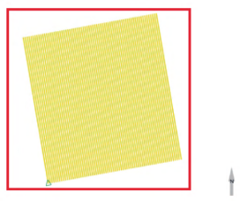
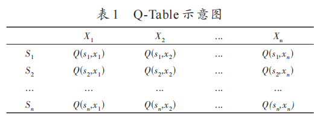
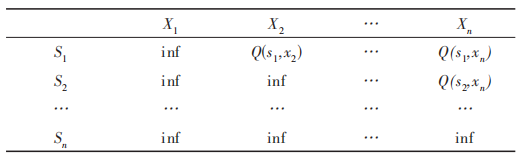
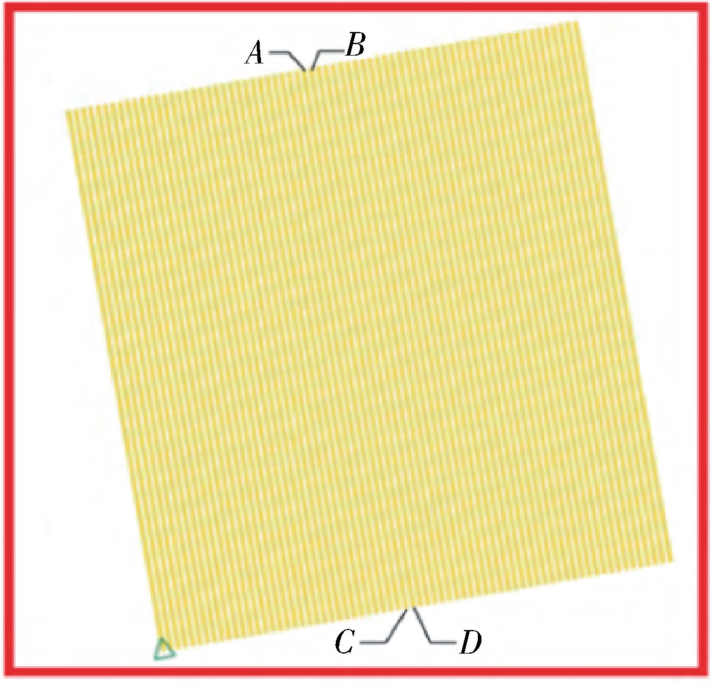
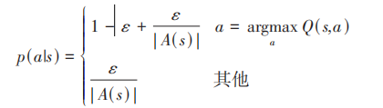
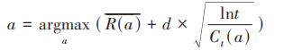
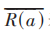
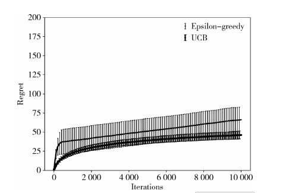
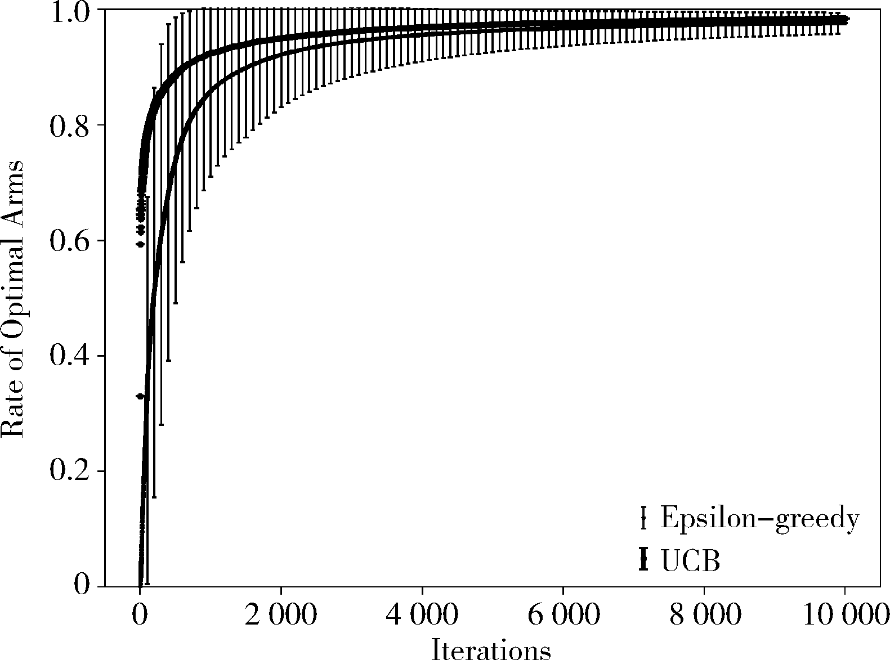

摘  要：海上地震勘探航线规划作为综合导航系统的重要组成部分，一直是各家石油公司的研究重点。由于海上地
震勘探的特殊作业环境，除洋流、障碍物、水下环境和渔业等因素的干扰外，拖缆作业实际施工效率较低，直接导致
工区采集成本的增加。提出一种基于强化Q 学习的海上地震勘探航线自动规划方法，以工区前绘测线为研究对象，
自动规划拖缆船航行线路，减少人为因素干扰，提高拖缆作业的工作效率，有利于海上油气田勘探效益最大化和可
持续发展。

海上地震勘探航线规划作为综合导航系统的重要
组成部分，一直是各家石油公司的研究重点。由于海上
地震勘探的特殊作业环境，除洋流、障碍物、水下环境和
渔业等因素的干扰外，拖缆船在工区内的航线规划往往
来自于工作人员的现场决策，受限于人员工作经验等因
素，拖缆作业实际施工效率较低，直接导致工区采集成
本的增加。拖缆法地震勘探作为海上地震勘探的重要
方法，当前国内外各主要石油公司都非常重视对拖缆地

震勘探相关技术的研究，以提高作业效率，探索海上地
震勘探新技术与新方法。
多年来,人们将机器学习应用于医学、军事等各种行
业 ，但是其应用于石油物探领域是近年来才发展起来
的，并取得了良好效果。2020 年，何健等人利用随机森
林方法预测裂缝发育带，证明随机森林方法对裂缝带预
测结果准确度较高[1]
。2021 年，杨午阳等人提出一种基
于 U-Net 深度学习网络的地震数据断层检测方法，取得
了良好效果[2] 。

近 几 年 ，强 化 学 习（Reinforcement Learning, RL）作
为机器学习的重要组成部分，被广泛应用于解决路径规
划等优化策略问题。2018 年，王程博等人提出一种基于
强 化 Q 学 习（Q-Learning）的 无 人 驾 驶 船 舶 路 径 规 划 模
型，有效地在未知环境中规划出较优路径及成功避让多
个障碍物[3]
。2019 年，封佳祥等人提出一种多任务约束
条件下基于强化学习的水面无人艇路径规划方法，实现
了 完 成 多 任 务 约 束 条 件 下 的 无 人 艇 路 径 规 划[4]
。 QLearning 是一种基于 Q 值迭代的无模型强化学习方法，
如今被广泛应用于各个领域[5]
。2020 年，胡学敏等人提
出基于深度时空 Q 网络的定向导航自动驾驶运动规划
方法来实现定向导航的目的[6]
。2021 年，周彬等人提出
了基于导向强化 Q 学习的无人机路径规划方法，实现无
人机的自主导航和快速路径规划[7]
。2022 年，杨秀霞等
人提出一种基于阶段 Q 学习的机器人路径规划方法，使
得机器人在复杂环境中能够迅速找到无碰撞路径[8]
。
作为一种新技术，Q-Learning 方法在解决路径规划
问题过程中取得了良好效果。该方法引入石油物探领
域解决海上地震勘探航线规划，将会显著提升物探船的
作业效率。

1 问题重述
1.1 问题描述
拖缆法地震勘探的工作模式为：根据勘探目标，首
先根据勘测区块的地理环境、航运和渔业等情况规划本
次勘探的工区范围；然后在工区中根据勘探目标规划若
干条物探船的航线（测线），当物探船拖拽电缆到达预定
测线的起点时，此时船上部署的综合导航系统会对船载
震源进行激发，产生地震波，同时记录系统开始对地震
资料进行记录，此过程称为“上线”;当船行驶到测线结
束点时，导航系统发出信号终止船载震源工作，记录系
统随即停止记录，此过程称为“下线”。在下线期间，往
往需要选择下一条需要上线的测线，这个过程既要降低
开采成本又要保证工作效率，而大多数需要工程师现场
决策，具有较大的随意性和不可控性。

1.2 问题抽象
当不考虑洋流、障碍物和过往船只等因素时，可将
该问题抽象为如图 1 所示的数学模型。图中外框为工区
边界，内部灰色线段为工区内测线。当船在上线期间，
船的施工效率是定值，则整个工区的作业效率取决于船
在上下线期间，选择下一条测线的距离与转弯半径等因
素，施工效率与物探船在整个作业过程中走过的路程负
相关，即路程越短，施工效率越高。整个海上地震勘探
航线优化问题抽象为求物探船作业最短路径问题。

1.3 实际作业中需要注意的问题
方法原理在实际拖缆作业过程中，除考虑总体施工
路径最短外，还要考虑其他因素，如随时保证拖带的电缆保持合理间距、电缆在上线前需要拉直等。这些因素
导致航线规划需要在最短施工距离和实际生产情况两
者之间寻求平衡。生产条件下的航线规划需满足如下
条件：
（1）对工区内所有测线进行“分块”，以降低拖缆船
采用过小角度转弯导致电缆缠绕带来的风险；
（2）在拖缆船上线之前，要预留出足够的路程，保证
上线前电缆拉直；
（3）拖缆船的转弯半径不能过小，要设置最小转弯
半径。

海上石油勘探工区示意图

2 方法原理
2.1 Q-Learning 方法原理
Q-Learning 是一种基于马尔科夫属性构造的强化学
习方法，被广泛应用于求解路径规划问题[9]
。一个基本
的马尔科夫模型可以用<S，X，P，R，y>来描述，其中，环
境中所有状态集为 S，环境中所有动作集为 X，不同状态
之间的转移概率集为 P，采取某个动作后得到的奖励集
为 R，表 示 未 来 得 到 的 奖 励 值 的 比 例 系 数 为 y。 QLearning 作为一种马尔科夫模型，要满足马尔科夫模型
的两个前提条件：(1)决策过程可以通过多次尝试，最终
能够检测到理想状态；(2)系统下一状态只与当前状态有
关，与更早之前的状态无关，在决策过程中还与当前采
取的动作有关，如式(1)所示：
    P(st + 1|st,st - 1,⋯,s1 ) = P(st + 1|st ) (1)

一 个 典 型 的 Q-Learning 方 法 的 运 行 过 程 可 以 表 示
为：设定某一时刻的状态 si 与即将采取的动作 xi，在当前
状态 si 采取动作 xi 取得的奖励为 Q(si
,xi )，计算方式如式
(2)所示：

Q(si,xi )←Q(si,xi )+ l ×[ R(si )+ y ×max Q(si+ 1,xi )-Q(si,xi ) ]    (2)

其中，l 为学习率，R (si ) 和 y 分别为 i 时刻取得的奖励和
比例系数。当搜索完成当前时刻状态 si 和所有可能发
生的动作 X (si ) 后，就可以根据式(2)反馈的奖励集中选
择一个最优动作进入下一时刻状态 si + 1 并进入下一次迭
代过程，直至所有状态的奖励值 Q 相对稳定或触发终止条件后，完成迭代。
Q-Learning 在迭代过程中的每一个动作、每一个状
态 都 对 应 一 个 Q 值 ，所 有 的 Q 值 可 组 成 一 个 二 维 矩 阵
（Q-Table），可通过查表的方式来选择最优动作，Q-Table
如表 1 所示。
表 1 Q-Table 示意图

综上所示，Q-Learning 方法的伪代码表述如下所示：
输入:初始化 Q(s,x),s⊂S,x⊂X(s),Q(s−termianl,x)=0,R(s)=
0,l,y⊂(0,1];
输出:目标状态 S。
(1)Initizlize S;
(2)if S is not terminal then
(3)select x from S using policy derived from Q(e −
greedy);
(4)Take action x, observe x′ and R;
(5)Q(s,x)←Q(s,x)+l×(R(s)+y(Q(s′,x′)−Q(s,x));
(6)S←S′
(7)final;
(8)return S−termianl

2.2 基于强化 Q 学习的海上地震勘探航线自动规划方
法原理
基于 Q-Learning 方法，本文提出一种基于强化 Q 学
习的海上地震勘探航线自动规划方法，用于求解物探船
勘探航线自动规划问题。

2.2.2 Q-Table 矩阵的构建
根据实际作业需求，物探船在转弯时，每次作业起
始点都应在同一侧，如图 7 所示。当物探船沿测线 AC
进行作业时，物探船到达 C 点处下线，则再次上线点选
择点 D 或同侧测线起点，不能选择 B 点或同侧测线起点
上线。除此之外，每条测线仅作业一次，设物探船在作
业过程中效率为定值，则整个工区的作业效率取决于物
探船在上下线之间行驶的路程。
基于以上假设，构建两个 Q-Table 矩阵，Q1 表示随机
选择的测线断点一侧的 Q-Table 矩阵（如图 7 中 AB 侧），
Q2 表示另一侧的 Q-Table 矩阵（如图 7 中 CD 侧），以 Q1
为例，如表 2 所示，表中 inf 表示该位置 Q 值不存在，Sn 表
示测线编号，Xn 表示物探船在第 n 条测线断点处所采取
的行动。

表 2 Q1矩阵示意图

图 7　上线点选择示意图

2.2.3 对于搜索策略的改进
强化学习理论主要是用于解决在环境和动作奖励
未知的情况下，智能体通过不断迭代学习最终得到最优
行动决策的过程[10]
。物探船的路径规划策略可视为一
种多臂赌博机（Multi-Armed Bandit, MAB）问题，目前众
多学者设计了多种优化搜索策略[11]
用于求解此类问题。
其中最为常用的是 ε-greedy 方法，如式（6）所示，其中大
写符号代表随机变量，小写符号代表随机变量的一次具
体实现，A(s)表示当前时刻 s 所采取的动作，Q(s,a)表示
具体动作 a 对应的估计价值。

式（6）

ε -greedy 方法是在智能体在做决策时，有一很小的
正数 ε(ε<1)的概率随机选择未知的一个动作，剩下 1-ε
的概率选择已有动作集中选择回报最大的动作。但此
方法存在明显缺陷：虽然每个动作都有被选择的概率，
但是这种选择太过于随机，有一些动作应该是可以达到
全局最优，但由于初始化的原因，使得它被访问的概率很
低，这并不能有助于智能体大概率的寻找最优决策路径。
UCB（Upper Confidence Bound）方法用于求解 MAB
问题，并取得良好效果[12]
。其原理是通过用每个动作的
取值区间的上界，来代替动作奖励期望进行选择，动作
选择过程如式（7）所示：

式（7）

其中， 表示当前选择的动作在过去取得增益的平均
值，t 表示当前时刻，d 表示置信区间参数，Ct (a) 表示当
前动作被选择的总次数。
随着方法的不断迭代，Ct (a) 持续增大，使得动作选
择策略倾向于探索未知动作，但同时受到置信区间参数
项的制约，在搜索和利用二者之间取得了平衡。
根据控制变量原则，使用上述两种方法进行对 MAB
问题进行求解，结果如图 8、图 9 所示。

图 8　每轮迭代中回报的累积情况

图 9　方法选择优解的速率情况

在图 8、图 9 中，横坐标表示循环次数（Iterations），图
8 的纵坐标表示每轮迭代中回报的累积（Regret），图 9 表
示纵坐标表示该方法选择最优解的速率（Rate of Opti‐
mal Arms）。由实验结果可知，UCB 方法的收敛性优于
ε-greedy 方法，本文使用 UCB 方法替代 ε-greedy 方法搜
索策略。

4 结论
本文提出一种基于强化 Q 学习的海上地震勘探航
线自动规划方法，以工区前绘测线为研究对象，自动规
划物探船航行线路，减少人为因素干扰，提高拖缆作业
的工作效率。实验证明本文提出方法相较传统人工规
划方法具有一定的优越性，具体结论如下:
(1)本文所提出方法在规划后的物探船行程可满足
工区内所有测线进行“分块”作业，符合实际采集作业
要求。
（2）本文所提出方法可保证在拖缆船上线之前预留
出足够的路程，保证上线前电缆拉直；同时还可根据设
置的转弯半径和物探船上线之前预留的路程，进行自适
应变化。
（3）使用本文所提出方法规划后的物探船行程要优
于初始规划行程约 19%，在形状规则工区和不规则工区
应用均取得良好效果。